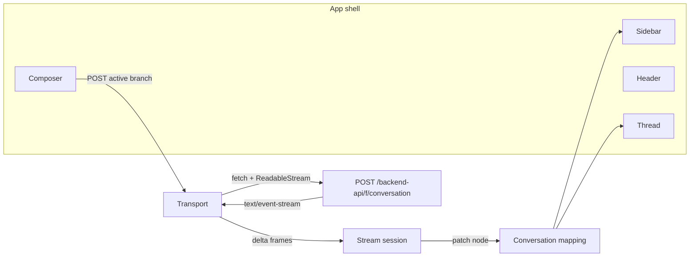
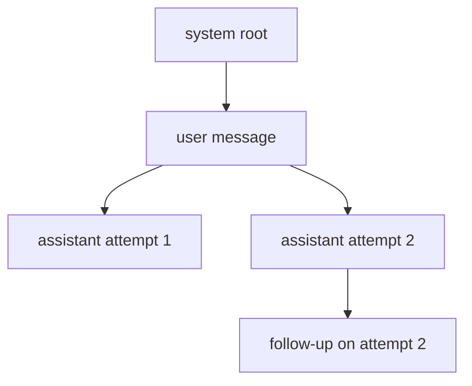
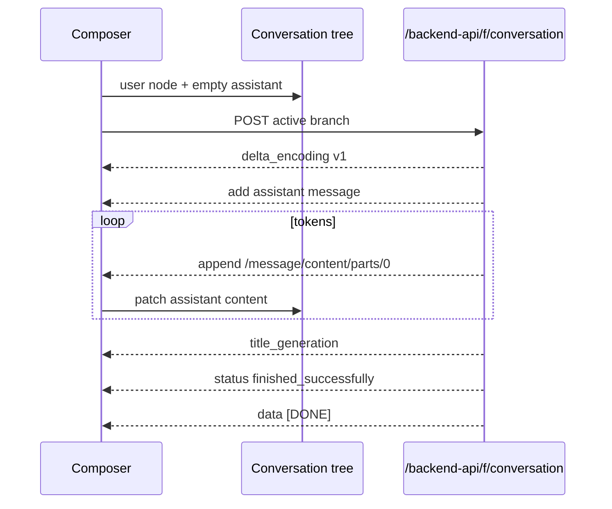

# Frontend architecture

The ChatGPT web client is a React shell around one idea: a conversation is a tree, and the model’s answer is a stream of patches. This prototype uses that same split. The page does not wait for a finished JSON body, and it does not keep messages in a flat array.



## Routes

| URL | Role |
| --- | --- |
| `/` | New chat. The composer sits in the middle of the screen. |
| `/c/:id` | An existing chat. The thread scrolls and the composer pins to the bottom. |
| `POST /backend-api/f/conversation` | The streaming answer. Same path shape the production client uses. |
| `POST /backend-api/f/conversation/prepare` | Fired while the draft sits in the box, before Enter. |
| `GET /backend-api/models` | Models the picker can offer. |

The shell is mounted from the root layout, so moving from `/` to `/c/:id` does not remount the thread. The first tokens can paint before the URL has finished updating. The address bar is still the source of truth: browser back returns to the new-chat screen, and the conversation remains in the sidebar.

Production also calls a Sentinel anti-bot gate, telemetry, and a websocket resume channel. Those are omitted. The resume token is still issued and stored so the client has a place to hang that later.

## Component tree

```
AppShell
├── Sidebar                  recent chats, grouped, plus New chat
└── ChatScreen
    ├── header               sidebar toggle and model menu
    ├── MessageList          only when the active branch has messages
    │   └── Message          user bubble or assistant markdown
    └── Composer             textarea, send, or stop
```

`ChatProvider` owns the tree, the selected model, and the in-flight stream. Screens read it with `useChat()`. Nothing in the thread fetches on its own except the composer’s debounced prepare call.

## Conversation tree

A chat is not a list. It is a map of nodes plus a pointer to the node you are looking at, which is the same `mapping` / `current_node` model the production client keeps.

```ts
type Conversation = {
  id: string
  title: string
  currentNodeId: string
  resumeToken?: string
  mapping: Record<string, MessageNode>
}
```

Each node has `id`, `parentId`, `role`, `content`, and `status`. A new chat starts with a system root that is never rendered. The user message parents to that root, and the assistant message parents to the user message. `currentNodeId` moves to the assistant as soon as you send, so the thread can show an empty in-progress answer immediately.

The visible thread is the walk from `currentNodeId` back to the root, reversed, with the system node removed. That walk is also what gets posted as `messages`. Branches you are not looking at are not sent.

Regenerate does not delete the previous answer. It inserts another assistant under the same user node and points `currentNodeId` at the new one. Both answers stay in the map. The `‹ 1/2 ›` control calls `activateNode`, which jumps to that sibling and then down to the latest child of that branch. A follow-up on one branch does not appear when you switch back to the other.



Statuses on a node are `in_progress`, `finished_successfully`, `stopped`, and `error`. A refresh cannot resume a socket that is already gone, so any `in_progress` node loaded from storage is settled to `stopped`.

## What happens on Enter

1. The provider trims the draft and refuses a second send while one stream is in flight.
2. It appends a user node and an empty assistant node in memory, and moves the URL to `/c/:id` if this is a new chat.
3. It `POST`s the active branch to `/backend-api/f/conversation` with `Accept: text/event-stream`. The body carries `conversation_id`, `parent_message_id`, `message_id`, `model`, and `messages`.
4. `readSse` pulls `response.body` with a reader and splits it on blank lines. `EventSource` is the wrong API here: it only does GET, and the prompt has to ride in the body. This is why the finished stream shows up as an ordinary fetch in DevTools rather than under the EventStream filter.
5. Each frame goes through `applyFrame`. Delta frames update a small session object. The session’s assistant text and status are copied onto the tree on the next animation frame, so a burst of tokens does not render once per chunk.
6. `title_generation` renames the chat once, and only while the title is still “New chat”.
7. The reader finishes, the node is `finished_successfully`, or Stop aborts the fetch and the node becomes `stopped` with whatever text had already landed.



Stop uses `AbortController`. The provider also flips the node to `stopped` immediately so the button does not wait on the network. The server observes the same abort and ends its stream instead of keeping the generator running.

## Prepare

While the draft is non-empty, the composer waits 450ms and `POST`s it to `/backend-api/f/conversation/prepare`. Production does this so the backend can warm the model before Enter. Here the handler acknowledges the draft and reports `warmup_state`. The send path does not wait on it. A newer keystroke aborts the previous prepare request.

## Persistence and model picker

Chats live in `localStorage` under `chatgpt-clone.v1`. There is no account. The sidebar groups them into Today, Yesterday, Previous 7 days, and Older.

The header menu reads `GET /backend-api/models`. `gpt-prototype` is always there. If `OPENAI_API_KEY` is set, the configured hosted model is added. Choosing it does not change the client protocol: the server reads the hosted SSE stream and rewrites each content delta into delta encoding v1.

## Where the pieces live

| Concern | Module |
| --- | --- |
| JSON pointer patches and the sticky cursor | `lib/delta.ts` |
| Encode, split, and read SSE | `lib/sse.ts` |
| Turn frames into an assistant snapshot | `lib/stream-session.ts` |
| Tree edits: append, regenerate, switch branch | `lib/tree.ts` |
| Server stream and local pacing | `lib/conversation-stream.ts` |
| Request checks | `lib/server-handler.ts` |
| React state and the fetch loop | `components/chat-provider.tsx` |
| Thread rendering | `components/message-list.tsx` |
| Draft box and prepare | `components/composer.tsx` |

The wire format itself is written up in [sse.md](sse.md).
